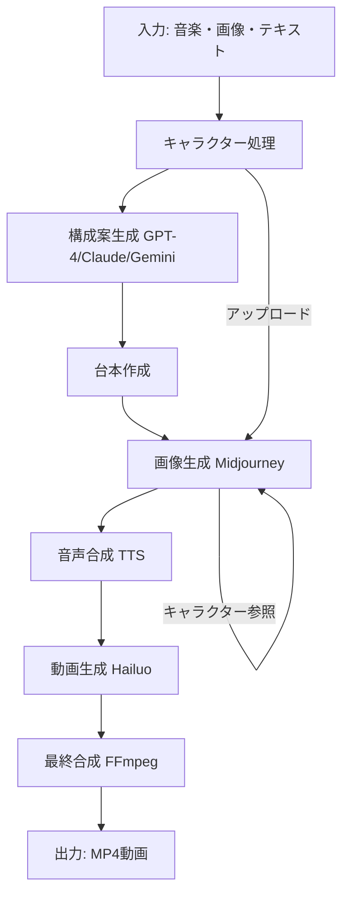

# MCP Server Specification - PV AI Generator v2.3.0

## 概要
PV自動生成AIエージェントのMCP（Model Context Protocol）サーバー仕様書

## サーバー情報

### 基本情報
- **名称**: pv-ai-generator-mcp-server
- **バージョン**: 2.3.0
- **最終更新**: 2025-08-20
- **開発者**: Kotaro Kashiwai
- **ライセンス**: MIT

### デプロイメント
- **Streamlit Cloud**: https://pv-ai-generator-8tfxczsibmrquxq9ybjxgi.streamlit.app
- **GitHub**: https://github.com/kashiwai/pv-ai-generator
- **Hugging Face Spaces**: https://huggingface.co/spaces/mmz2501/pv-ai-generator

## API仕様

### 1. PIAPI (Midjourney / Hailuo統合)

#### エンドポイント

##### タスク作成
```http
POST https://api.piapi.ai/api/v1/task
Headers:
  x-api-key: {PIAPI_XKEY}
  Content-Type: application/json

Body:
{
  "model": "midjourney",
  "task_type": "imagine",
  "input": {
    "prompt": "string with --ar 16:9 --v 6.1 --cref {url} --cw 100",
    "process_mode": "relax",
    "skip_prompt_check": false
  }
}
```

##### タスクステータス確認
```http
GET https://api.piapi.ai/api/v1/task/{task_id}
Headers:
  x-api-key: {PIAPI_XKEY}

Response:
{
  "status": "completed|processing|failed",
  "output": {
    "image_url": "string",
    "progress": 0-100
  }
}
```

##### 画像アップロード（キャラクター参照用）
```http
POST https://api.piapi.ai/upload/image
Headers:
  x-api-key: {PIAPI_XKEY}
  Content-Type: application/json

Body:
{
  "image": "data:image/png;base64,{base64_string}",
  "purpose": "character_reference"
}

Response:
{
  "url": "https://..."
}
```

### 2. Midjourney パラメータ

| パラメータ | 説明 | 値 | 必須 |
|---------|------|-----|-----|
| `--ar` | アスペクト比 | 16:9, 1:1, 4:3等 | ✓ |
| `--v` | バージョン | 6.1（推奨） | ✓ |
| `--cref` | キャラクター参照URL | 画像URL | × |
| `--cw` | 一貫性の重み | 0-100（100推奨） | × |
| `--style` | スタイル指定 | raw, stylize等 | × |
| `--q` | 品質 | 0.25, 0.5, 1, 2 | × |

### 3. キャラクター一貫性実装

```python
# 実装フロー
1. upload_image_for_reference(image_path)
   → Base64エンコード
   → PIAPIアップロード
   → URLを取得

2. generate_with_midjourney(prompt, character_ref_url)
   → プロンプトに --cref {url} --cw 100 を追加
   → タスク作成
   → 完了待機

3. wait_for_midjourney_completion(task_id)
   → 5秒間隔でステータスチェック
   → 最大300秒待機
   → 画像URL取得
```

## モジュール構成

### agent_core/character/
```
generator.py
├── CharacterGenerator
│   ├── generate_characters()
│   ├── generate_with_midjourney()
│   ├── generate_with_dalle()
│   ├── wait_for_midjourney_completion()
│   ├── upload_image_for_reference()
│   └── generate_character_with_consistency()

image_picker.py
├── ImagePicker
│   ├── process_images()
│   ├── register_character()
│   ├── prepare_for_midjourney()
│   └── export_character_prompt()
```

### agent_core/plot/
```
script_planner.py
├── ScriptPlanner
│   ├── generate_plot_options()
│   └── select_best_plot()

script_writer.py
├── ScriptWriter
│   ├── write_script()
│   └── generate_scene_descriptions()
```

### agent_core/tts/
```
tts_generator.py
├── TTSGenerator
│   ├── generate_narration()
│   ├── generate_with_google()
│   └── generate_with_fish()
```

### agent_core/video/
```
scene_generator.py
├── SceneGenerator
│   ├── generate_scene_prompts()
│   ├── generate_videos()
│   └── generate_with_hailuo()
```

### agent_core/composer/
```
merge_video.py
├── VideoComposer
│   ├── compose_final_video()
│   ├── add_transitions()
│   └── sync_with_music()
```

## ワークフロー



## 環境変数

### 必須
```env
PIAPI_KEY=メインキー
PIAPI_XKEY=Xキー（Midjourney/Hailuo用）
```

### オプション
```env
OPENAI_API_KEY=OpenAIキー
GOOGLE_API_KEY=Googleキー
ANTHROPIC_API_KEY=Claudeキー
FISH_AUDIO_API_KEY=Fish Audioキー
DEEPSEEK_API_KEY=Deepseekキー
```

## 設定パラメータ

```json
{
  "max_video_duration": 420,     // 最大7分
  "scene_duration": 8,            // 各シーン8秒
  "output_resolution": [1920, 1080],
  "output_fps": 30,
  "audio_bitrate": "192k",
  "video_bitrate": "5000k"
}
```

## サポートフォーマット

### 入力
- **音声**: MP3, WAV, M4A, AAC
- **画像**: PNG, JPG, JPEG, WebP
- **動画**: MP4, MOV, AVI

### 出力
- **動画**: MP4 (H.264/AAC)
- **解像度**: 1920x1080 (Full HD)
- **FPS**: 30

## エラーハンドリング

### Midjourney失敗時
1. エラーログ記録
2. DALL-E 3へフォールバック
3. ユーザーへ通知

### API制限
- デイリーリミット検出
- クレジット不足検出
- 自動リトライ（最大3回）

## テスト

### テストスクリプト
```bash
# Midjourney統合テスト
python test_midjourney.py

# アプリケーションテスト
python test_app.py
```

### 検証項目
- PIAPI接続確認
- キャラクター一貫性テスト
- APIキー認証テスト
- エンドツーエンドテスト

## バージョン履歴

### v2.3.0 (2025-08-20)
- Midjourney統合修正
- キャラクター一貫性実装
- PIAPI v1対応

### v2.2.0 (2025-08-13)
- DALL-E 3統合
- 基本Midjourney連携

### v2.1.0 (2025-07-01)
- Hailuo AI統合
- 音楽同期機能

## 次期バージョン予定 (v2.4.0)

### 計画中の機能
- リアルタイム生成プレビュー
- バッチ処理の最適化
- 複数キャラクター同時管理
- 動的シーン長調整
- WebSocket通信対応
- プログレッシブレンダリング

### 技術的改善
- Redis キャッシュ統合
- WebRTC ストリーミング
- GPU アクセラレーション
- 分散処理対応

## ライセンス

MIT License

Copyright (c) 2025 Kotaro Kashiwai

## サポート

- GitHub Issues: https://github.com/kashiwai/pv-ai-generator/issues
- Documentation: https://github.com/kashiwai/pv-ai-generator/wiki
- Contact: GitHub経由でお問い合わせください